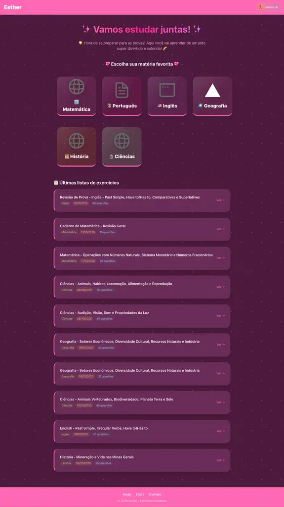
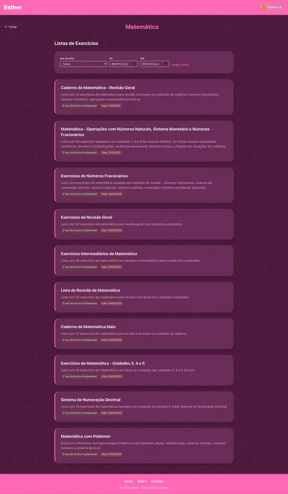
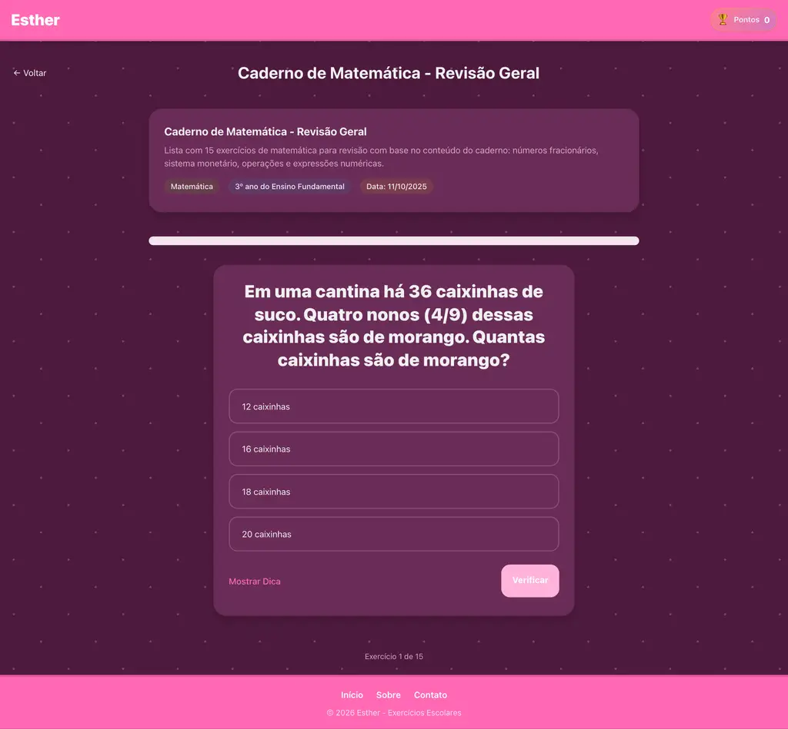

# Esther — exercícios escolares com cara de jogo

> **Vamos estudar juntas?** A Esther transforma a revisão para as provas em uma aventura curta, colorida e cheia de feedback imediato.

🌐 **Acesse agora:** [pedrolopesme.github.io/esther](https://pedrolopesme.github.io/esther/)

A Esther é uma plataforma de exercícios escolares para crianças do Ensino Fundamental. A criança escolhe uma matéria, resolve uma lista, recebe feedback na hora e acompanha sua pontuação — sem planilhas assustadoras e sem perder a diversão.

## ✨ O que tem por aqui

- 📚 **Seis matérias:** Matemática, Português, Inglês, Geografia, História e Ciências
- 🎯 **Listas de exercícios** organizadas por matéria e data
- 🧠 **Exercícios interativos** com múltipla escolha, verdadeiro ou falso, preenchimento e outros formatos
- 💬 **Dicas e feedback imediato** para aprender com cada resposta
- 📈 **Barra de progresso** para saber quanto falta
- 🏆 **Pontuação persistente** no navegador
- 🔊 **Efeitos sonoros** para acertos, erros e conclusão de listas
- 📱 **Layout responsivo** para computador, tablet e celular
- 🌈 **Visual inspirado em jogos de aprendizagem**, com bastante cor e incentivo

## 🖼️ Espiadinha da Esther

### Página inicial



### Escolha uma lista



### Hora de responder



## 🚀 Rodando localmente

### Pré-requisitos

- Node.js 20 ou superior
- npm

### Desenvolvimento

```bash
npm install
npm run dev
```

Abra [http://localhost:3000](http://localhost:3000).

### Build estático local

A Esther é exportada como site estático para funcionar no GitHub Pages:

```bash
make run
```

Esse comando executa o build local e serve a pasta `out/` em [http://localhost:3000](http://localhost:3000).

Também é possível executar os comandos separadamente:

```bash
make build  # gera out/ para uso local
make test   # executa a verificação configurada no projeto
```

Para simular o build usado no GitHub Pages:

```bash
make build-prod
```

## 🧩 Como os dados funcionam

Os exercícios ficam em arquivos JSON dentro de `public/data/`. Cada matéria possui um `index.json` com o catálogo de listas, e `public/data/latest.json` alimenta a seção de listas recentes da página inicial.

Exemplo de lista:

```json
{
  "title": "Título da lista",
  "description": "Uma revisão rápida e divertida.",
  "materia": "Matemática",
  "ano_letivo": "3º ano do Ensino Fundamental",
  "data": "2025-10-12",
  "exercises": [
    {
      "type": "multiple-choice",
      "question": "Quanto é 2 + 2?",
      "options": ["3", "4", "5"],
      "correctIndex": 1
    }
  ]
}
```

Ao adicionar ou alterar uma lista, atualize também o `index.json` da matéria e o `latest.json` quando necessário.

## 🛠️ Tecnologias

- [Next.js 15](https://nextjs.org/)
- [React 19](https://react.dev/)
- [Tailwind CSS 4](https://tailwindcss.com/)
- [Framer Motion](https://motion.dev/)
- JSON para armazenamento das listas
- GitHub Actions + GitHub Pages para publicação

## 📦 Estrutura principal

```text
.
├── public/
│   ├── data/                 # listas e catálogos JSON
│   └── *.mp3                # sons de feedback
├── src/
│   ├── app/                  # páginas e rotas do Next.js
│   ├── components/           # componentes visuais e exercícios
│   ├── hooks/                # comportamentos reutilizáveis
│   └── utils/                # carregamento de dados e assets
├── docs/screenshots/         # screenshots usadas nesta documentação
├── .github/workflows/        # deploy automático no GitHub Pages
├── Makefile
└── next.config.mjs
```

## 🌍 Publicação no GitHub Pages

Cada push na branch `main` dispara o workflow de deploy:

1. O GitHub instala as dependências.
2. O Next.js gera o export estático em `out/`.
3. O artefato é publicado no GitHub Pages.

O projeto usa `NEXT_PUBLIC_BASE_PATH=/esther` no build de produção para que imagens, sons, dados JSON e scripts funcionem no endereço do projeto:

```text
https://pedrolopesme.github.io/esther/
```

## 💌 Ideias para a próxima fase

- Criar mais tipos de exercícios e desafios-relâmpago
- Adicionar conquistas e sequência diária de estudos
- Permitir imagens e áudio dentro das questões
- Criar uma área para professores montarem listas
- Melhorar acessibilidade e suporte a leitura em voz alta

Feito com carinho para transformar **“preciso estudar”** em **“só mais uma questão!”** 💖
